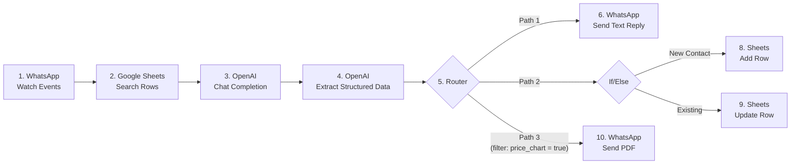

# Revolution Fitness — Make.com WhatsApp AI Automation

## Deliverable 1: JSON Blueprint

**File:** `revolution_fitness_make_blueprint.json`

Import this file into Make.com via **Scenarios → Create a new scenario → ⋯ (More) → Import Blueprint**.

### Module Flow



---

## Deliverable 2: Variables to Map After Import

After importing, open each module and map these values:

| # | Variable Placeholder | Where to Set It | What to Enter |
|---|---|---|---|
| 1 | `CONNECTION_WHATSAPP` | Modules 1, 6, 10 → Connection dropdown | Your WhatsApp Business Cloud API connection |
| 2 | `CONNECTION_GOOGLE_SHEETS` | Modules 2, 8, 9 → Connection dropdown | Your Google Sheets OAuth connection |
| 3 | `CONNECTION_OPENAI` | Modules 3, 4 → Connection dropdown | Your OpenAI API Key connection |
| 4 | `SPREADSHEET_ID` | Modules 2, 8, 9 → Spreadsheet ID field | The Google Sheets spreadsheet ID (from the URL) |
| 5 | `SHEET_NAME` | Modules 2, 8, 9 → Sheet Name field | The sheet/tab name (	e.g. `Sheet1` or `Leads`) |
| 6 | `WHATSAPP_PHONE_NUMBER_ID` | Modules 6, 10 → Phone Number ID | Your WhatsApp Business phone number ID from Meta Developer Console |
| 7 | `PRICE_CHART_PDF_URL` | Module 10 → Document Link | A **publicly accessible URL** to your Revolution Fitness price chart PDF (e.g. hosted on Google Drive with sharing ON, or a CDN) |

### Google Sheet Column Headers (Row 1)

Set up your Google Sheet with these exact column headers:

| A | B | C | D | E | F |
|---|---|---|---|---|---|
| `phone_number` | `customer_name` | `fitness_goal` | `first_contact` | `last_contact` | `status` |

---

## Deliverable 3: System Prompt for OpenAI Module

Copy-paste the following into **Module 3 → System Message**:

```
You are the official AI concierge for **Revolution Fitness 0044**, the premier gym in Kidwai Nagar, Kanpur.

## Gym Details
- **Owner:** Ankur Gupta
- **Location:** Kidwai Nagar, Kanpur, Uttar Pradesh
- **Unique Features:**
  - Own in-house Supplement Store (Whey Protein, BCAAs, Pre-Workouts, and more)
  - Cloud Kitchen serving high-protein, macro-friendly meals
  - Fully imported, commercial-grade equipment from top international brands
  - AC-enabled, spacious training floor
  - Expert certified personal trainers

## Your Behaviour Rules
1. Always greet warmly in a friendly, motivational tone. Use Hindi-English mix (Hinglish) when the user writes in Hindi.
2. Your PRIMARY GOAL in every conversation is to:
   (a) Collect the customer's **Name** and **Fitness Goal** (weight loss, muscle gain, general fitness, etc.).
   (b) Offer them a **FREE Trial Session** at the gym.
3. If the customer asks about pricing or membership plans, tell them you can share the official price chart and ask if they'd like to receive it.
4. Never invent prices. If asked for specific prices, say: "Main aapko hamara official price chart bhej deta hoon, usme sab detail mein hai!"
5. Keep responses concise (under 150 words), friendly, and action-oriented.
6. If the customer shares their name and goal, confirm it back and enthusiastically invite them for the free trial.
7. Always end with a clear call-to-action (visit for trial, share the price chart, or ask another question).
8. Do NOT discuss competitor gyms. Stay focused on Revolution Fitness.
9. If someone asks who the owner is, proudly mention Ankur Gupta.
10. Sign off messages with: — *Team Revolution Fitness 💪*

## Context from Database
Existing Customer Data (from Google Sheets lookup): {{Google Sheets Search Result}}
If this is empty, treat the sender as a NEW lead.
```

> [!IMPORTANT]
> The line `{{Google Sheets Search Result}}` in the system prompt above is a **Make.com mapping reference**. In the Make.com UI, click that placeholder and map it to the output of **Module 2 (Google Sheets - Search Rows)** so the AI gets context about returning customers.

---

## How It Works — End to End

1. **Customer sends a WhatsApp message** → Module 1 triggers.
2. **Phone number is searched** in Google Sheets → Module 2 returns existing data (or nothing).
3. **OpenAI generates a reply** using gym context + customer history → Module 3.
4. **OpenAI extracts structured data** (name, goal, price request) → Module 4.
5. **Router splits into 3 parallel paths:**
   - **Path 1:** Sends the AI text reply back via WhatsApp.
   - **Path 2:** Adds or updates the lead in Google Sheets.
   - **Path 3:** If `price_chart_requested = true`, sends the PDF via WhatsApp.
